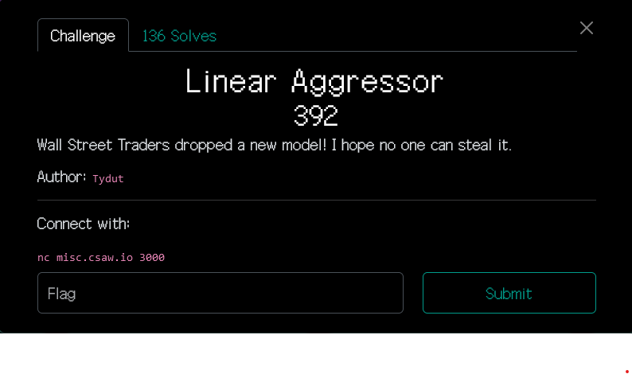

# Linear Aggressor

By lyu3e

### Challenge Description




### Analyse
```
    Wall Street Bros dropped a new model!
    Give me 30 numbers and I will give you a linear regression prediction.
    Enter your input:
```
Based on the server output, we need to input 30 numbers. The server will then provide either a linear regression prediction or possibly a flag-related output. If we enter non-positive integers, the server responds with "Not a valid input," and the program terminates. During my testing, I discovered that increasing the input values resulted in larger output numbers.

### Deduction
The testing prompted me to input all '0's, and the output was '125'. Subsequently, I replaced the last input with '1', resulting in an output of '250'. By subtracting 125 from 250, I deduced that the output was "}" and likely part of the flag.

I repeated this process several times, replacing the initial inputs with '1' each time, and confirmed that it was indeed the flag, which spelled out "csaw". I used a script to generate the remaining parts of the flag.

## Flag
csawctf{m0d1_5t341ing_i5_d}
